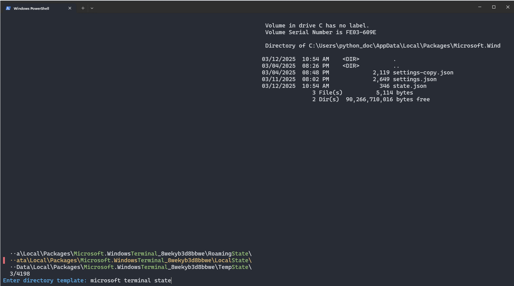
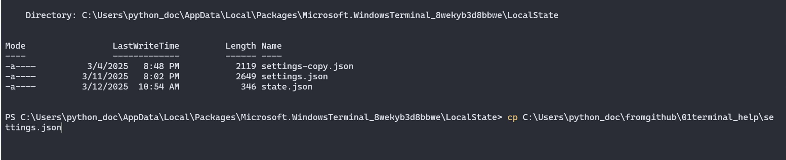

# Contents

 - [General information](#general-information)
 - [For Windows](#for-windows)
   - [Scoop installation](#scoop-installation)
   - [Micro installation](#micro-installation)
   - [fzf installation](#fzf-installation)
   - [fd installation](#fd-installation)
   - [bat installation](#bat-installation)
   - [PowerShell setup](#powershell-setup)

 - [For Linux](#for-linux)
 - [Micro Help](#micro-help)
 - [Tools](#tools)
 - [Web browser](#web-browser)
 - [Windows terminal settings](#windows-terminal-settings)


 

# General information 

For working with Python, a tool environment will be prepared to facilitate work using the keyboard:
- scoop: a program manager supporting open source
- micro: a console text editor
- setting environment variables, aliases and functions


Clone this repository to your computer:
- start terminal
- go (create) to the folder where you want to put the repository
- `git clone https://github.com/python-edu/01terminal_help.git` - clone the repository


# For Windows

## Scoop installation

From [Scoop](https://scoop.sh/#/):
 >- a command-line installer for Windows.
 >- Open a PowerShell terminal (version 5.1 or later) and from the PS C:\> prompt, run:

 ```
 Set-ExecutionPolicy -ExecutionPolicy RemoteSigned -Scope CurrentUser
 Invoke-RestMethod -Uri https://get.scoop.sh | Invoke-Expression
 ```


## Micro installation

From [micro web](https://micro-editor.github.io/):
>a modern and intuitive terminal-based text editor

In the PowerShell terminal, type:
```
scoop install micro
```

If you really don't want to learn micro you can use any other text editor e.g. [Nnotepad++](https://notepad-plus-plus.org/).


## fzf installation

From [fzf github](https://github.com/junegunn/fzf):
>- Warp, the intelligent terminal for developers
>- Available for MacOS, Linux, & Windows
>- fzf is a general-purpose command-line fuzzy finder

In the PowerShell terminal, type:
```
scoop install fzf
```


## fd installation

From [df github](https://github.com/sharkdp/fd):
>`fd` is a program to find entries in your filesystem. It is a simple, fast and user-friendly alternative to find.
```bash
scoop install fd
```


## bat installation

From [bat](https://github.com/sharkdp/bat):
>A `cat(1)` clone with syntax highlighting and Git integration.

```bash
scoop install bat
```


## PowerShell setup

The solutions in this section are intended for Windows users with a PowerShell terminal. Commands are executed in the
terminal or saved to a special configuration file, the location of which is set in the `$PROFILE` environment variable.

**Exception**:
>`$EDITOR` - this variable must be set in each operating system.


1. **PROFILE**
  `$PROFILE`: A PowerShell system variable that stores the path to the user's profile file. This is a script that is
  automatically executed when PowerShell starts. In the PowerShell terminal:
  
  >- `echo $PROFILE`: this will show you the location of the PowerShell configuration file eg.:
  `C:\Users\test1\Documents\WindowsPowerShell\Microsoft.PowerShell_profile.ps1`
  >- `dir Documents`: this will show if there is a folder `WindowsPowerShell` in the `Documents` directory:
    ```mkdir .\Documents\WindowsPowerShell```
    use this command to create directory `WindowsPowerShell` if it does not exist
  >- `micro $PROFILE`: editor will open/create the file for editing


2. **EDITOR variable**
  >`$env:EDITOR`: An environment variable that indicates the default text editor used in the terminal. Many programs can use
  this variable, such as Git, VS Code, ipython, etc. In the `$PROFILE` file add the following entry:
  
  ```
  $env:EDITOR = "micro"
  ```

3. **Aliases**
  For frequently executed commands, you can define shortcuts, so-called aliases, which speed up work, e.g.:
  
  ```micro $PROFILE
  Set-Alias mc micro
  ```
  - this allows you to launch the micro editor by typing 2 characters `mc`.


# For Linux

1. Installation of dependencies
  In distributions based on the `Debian` system, programs such as `fzf` and `micro` should be available in official
  repositories - this is the case, for example, for `Debian 12`. If necessary, use the information contained on the
  websites of these programs.
  
  Example of installation:
  ```bash
  sudo apt update
  sudo apt install fzf micro bat
  ```

2. Configuration
  - copy the `bash_func.sh` file (downloaded from the repository) to the directory in which you store your own scripts
  (let's assume that this is the `.scripts` catalog)
  - use the `chmod` command to make the script executable
  ```bash
  cp bash_func.sh ~/.scripts/fzf_func.sh
  chmod +x ~/.scripts/fzf_func.sh
  ```

  - open the `.bashrc` file eg.: `micro .bashrc`
  - add at the end of the file: path to the directory with your scripts (eg. `~/.scripts`) to `$PATH`
  - add at the end of the file: `source path_to_script.sh`
  -

  ```bash
  export PATH="$HOME/.scripts:$PATH"
  source $HOME/.scripts/fzf_linux_func.sh
  ```


# Micro Help

1. Link to [Default Keys](https://github.com/zyedidia/micro/blob/master/runtime/help/defaultkeys.md)
2. In the opened editor, enter:
  - `<ctr> + e`: open a command prompt for running commands
  - `Tab`: In command prompt, it will autocomplete if possible.
  - In command prompt: `help defa + Tab --> help defaultkeys` - will display help on defined keyboard shortcuts
3. Basic shortcuts:
  - `<ctr> + q`: close current file (quits micro if this is the last file open)
  - `<ctr> + o`: open a file (prompts for filename)
  - `<ctr> + s`: save current file.


## Tools
If the software installation and configuration have been made, the following tools for work in the terminal should be
available:

  - `mc`: launches the user-defined editor - probably `micro`
  - `fzf`: interactive file search in the current working directory
  - `mcc`: file search in the user's home directory with content preview (only text files) and opening to the edition of
     the selected file
  - `cdd`: search for catalogs with a preview of their content and transition to the selected directory

In the entered patterns you can use:
  - `$` - means that the pattern ends the line, e.g. TXT $ will search for all files or catalogs ending with `txt`
  - `|` logical `or` e.g.`txt $ | csv`
  - `' '` (space) logical `and` eg: `txt$ csv`


# Web browser

To view rendered `markdown` files, you may find useful browser extensions:

  1. Google Chrome: Markdown Viewer
  2. Mozilla Firefox: Markdown Viewer
  3. Microsoft Edge: Markdown Preview
  4. Safari: QLMarkdown


# Windows terminal settings

Creating a new account in Windows 11 requires each time settings according to the user's preferences.
The `settings.json` file contains the settings for the terminal in Windows 11. Example settings:
  - window size
  - font size
  - color scheme

Paste this file in a specific location on the disk allows you to easily transfer settings between accounts.

1. Determining the location of the `settings.json` file:
  - open powershell
  - run the `cdd` function
  - type: `microsoft terminal state`
  - go to the directory containing the `settings.json` file
  

2. For safety, make a copy of the original file:
  ```bash
  cp settings.json settings-copy.json
  ```
3. Copy the settings.json file (downloaded from gidhub):
  
